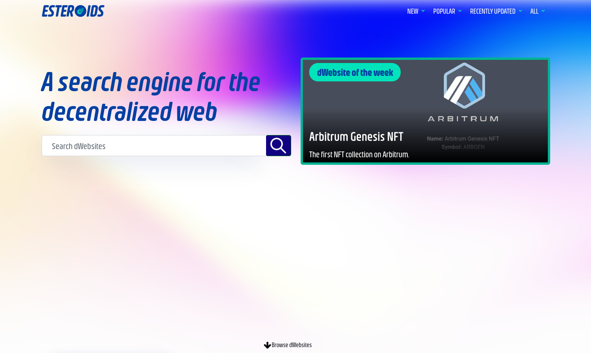

<h1 align="center"> Esteroids </h1> <br>
<p align="center">
  <a href="https://esteroids.eth.limo/">
    
  </a>
</p>

<p align="center">
  The front page of the decentralized web
</p>

## Table of contents
* [Introduction](#introduction)
* [Web App](#web-app)
* [Dependencies](#dependencies)
* [Installation](#installation)
* [Getting help](#getting-help)
* [Getting involved](#getting-involved)
* [License](#license)
* [Credits and references](#credits-and-references)

## Introduction
[Esteroids](https://esteroids.eth.limo) is a search engine for the decentralized web. It also includes tools for browsing which dWebsite the decentralized web has to offer. Esteroids is a decentralized website itself, based on ENS and IPNS (New  to decentralized web, read this first: [Intro to dWebsites](http://blog.almonit.eth.link/2020-05-21/Introduction_to_Dwebsitse.html)).


## Web App
This repository contains the source code of the web app that is the basis of [esteroids.eth](https://esteroids.eth.limo).

Esteroids Web App is a React App. It has client side only, does not rely on any backend, and is meant for users to search the decentralized web in complete privacy.

See live version in [esteroids.eth.limo](https://esteroids.eth.limo)




## Dependencies
To build Esteroids Web App you need to have installed on your machine:
- Node.js v14.16.1 
- Npm 6.13.7
- Yarn v1.22.5

## Installation
To install all the dependencies run:

```yarn```

Then you can run the webapp locally with:

```yarn start``` 

or build a static version of it with: 

```yarn build```

## Getting help
If you have questions, concerns, bug reports, etc, please open an issue in this repository's Issue Tracker, send us an email to contact@esteroids.xyz or come to our [Discord](http://discord.gg/9c2EWzjFzY).

## Getting involved
Esteroids is a project from the community by the community, and as such we encourage you to be involved. You can either contact us in email (contact@esteroids.xyz), [Twitter](https://twitter.com/e_steroids) or [Discord](http://discord.gg/9c2EWzjFzY), or simply form the project, add features, and do a PR for us to look at it.

----

## License
The code in this repository is published under MIT license. The content in this repository is published under CC-BY-SA 3.0 license.

----

## Credits and references

Esteroids was created by [Tomer Leicht](https://github.com/tomlightning) and [Eyal Ron](https://github.com/eyalron33).